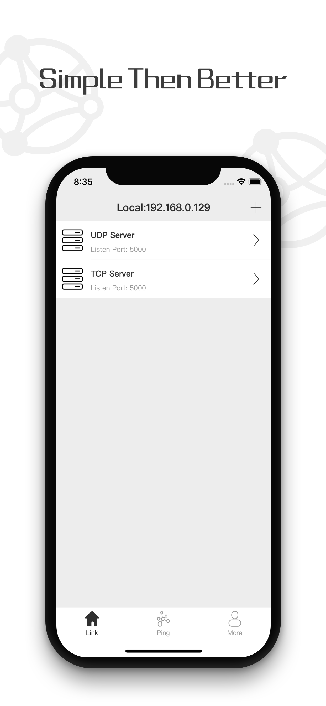
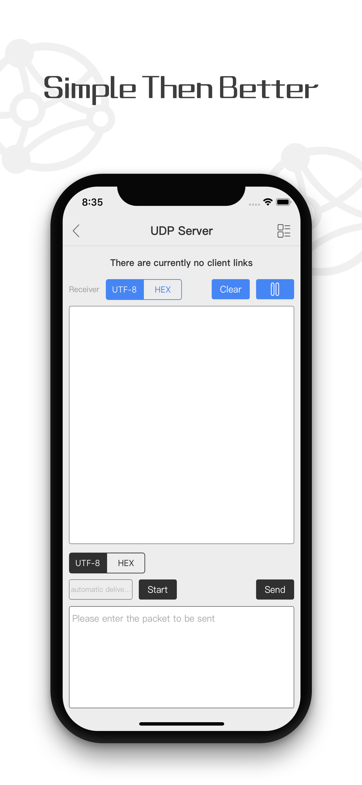
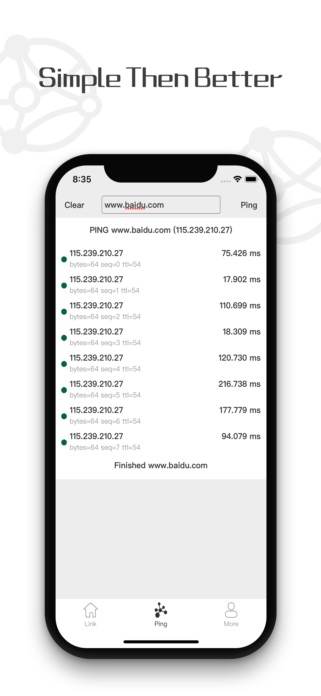

# Socket网络调试助手
## 一. 功能描述
网络调试工具是一款TCP&UDP通信调试工具，工具功能丰富，界面清晰，简单易用。可以协助网络维护人员、程序开发人员调试网络。主要功能包括：

* 1. 集成TCP客户端、服务端；UDP客户端、服务端
* 2. 支持Ping命令
* 3. 支持Whois功能
* 4. 多客户端链接同时管理
* 5. 定时自动发送报文
* 6. 支持16进制、UTF-8字符编码切换
* 7. 自动缓存上次发送报文
* 8. 支持UDP广播

## 二. 下载链接
* 1. [App Store地址](https://apps.apple.com/cn/app/id1461652639): <https://apps.apple.com/cn/app/id1461652639>
* 2. 二维码  

## 三. 部分效果图

